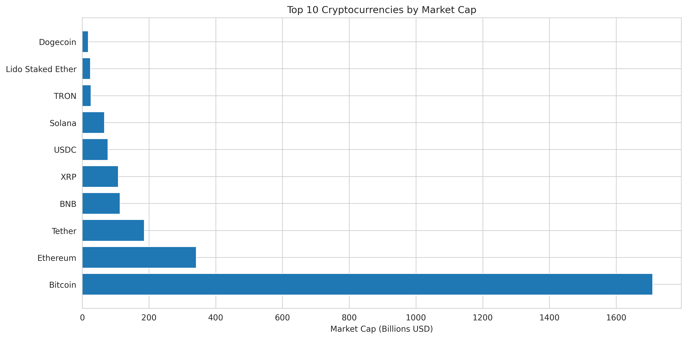
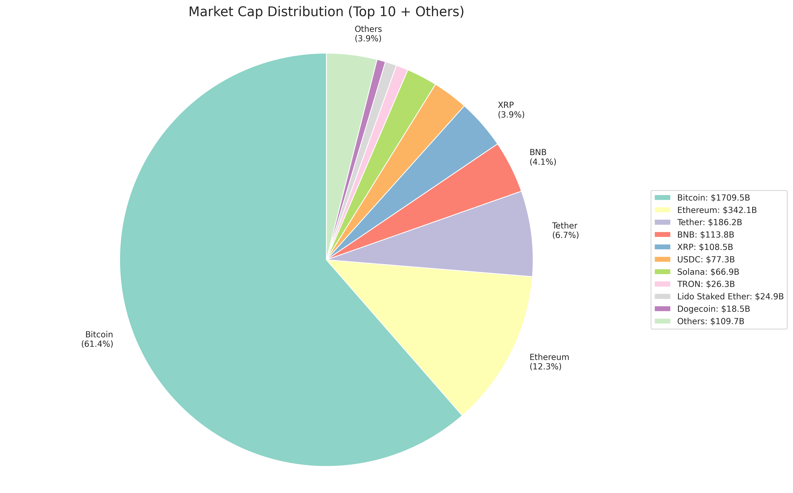
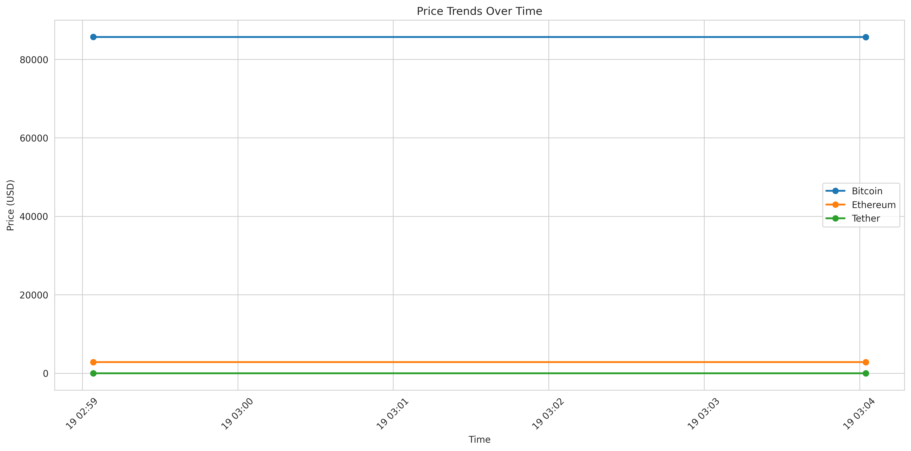
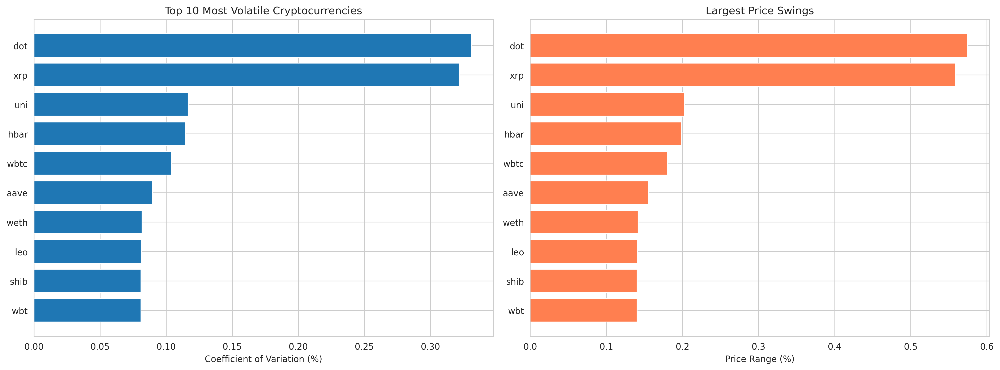
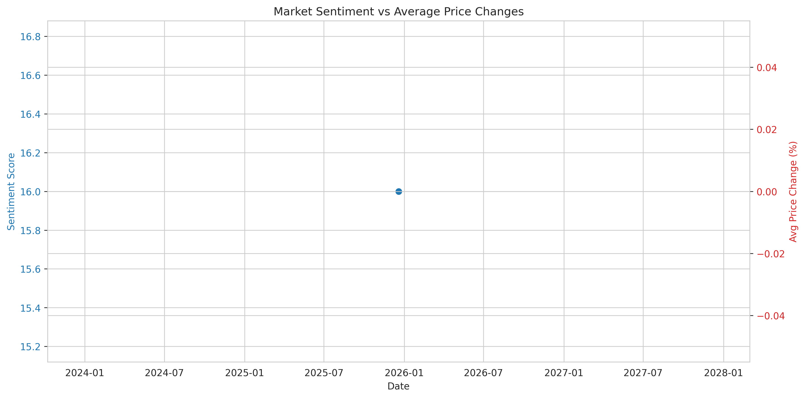
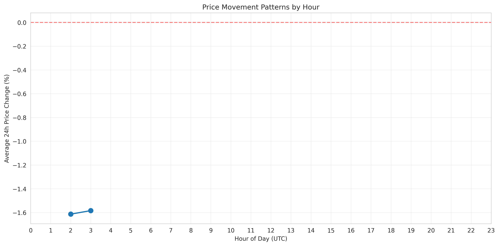
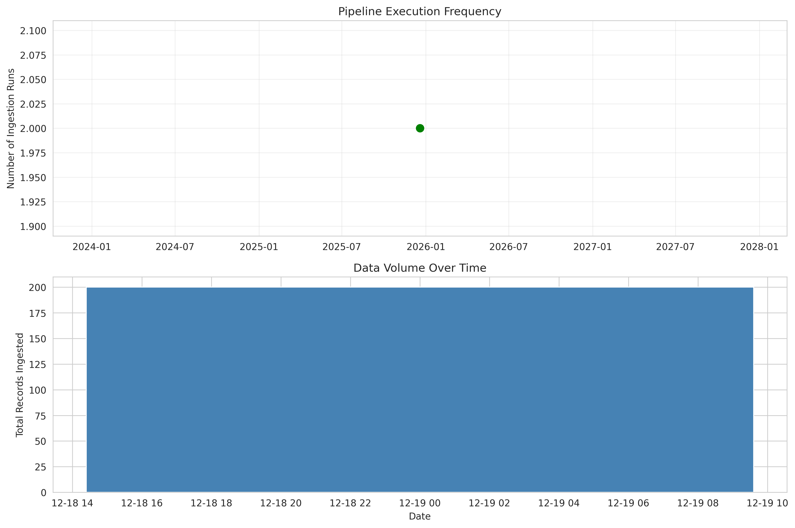

# Crypto Market Monitoring Pipeline
## (In progress)

An end-to-end data engineering project that ingests cryptocurrency market data from multiple sources, transforms it using dbt, and implements data quality monitoring with a dimensional model (STAR schema).

## Project Overview

This pipeline demonstrates:
- Multi-source data ingestion (price and sentiment data)
- Cloud-based data storage and warehousing (Google Cloud Platform)
- Incremental data processing with dbt
- Dimensional modeling (STAR schema)
- Data quality testing and validation
- Modern data transformation workflows

## Architecture

```
[CoinGecko API] ──┐
                  ├─> [Python Ingestion] -> [GCS Storage] -> [BigQuery Staging] -> [dbt Transformation] -> [Dimensional Model]
[Fear & Greed] ───┘
```

### Data Flow
1. **Sources**: CoinGecko API (prices/volume), Fear & Greed Index (market sentiment)
2. **Landing Zone**: Raw JSON files in Google Cloud Storage with timestamp partitioning
3. **Staging**: BigQuery tables for initial data landing (stg_prices_raw, stg_sentiment_raw)
4. **Transformation**: dbt models clean and transform data
5. **Warehouse**: STAR schema with fact and dimension tables
6. **Quality**: Automated data quality tests via dbt

### STAR Schema Design

```
        dim_coin                    dim_timestamp
        --------                    -------------
        coin_key  <---+         +-> timestamp_key
        coin_id       |         |   date
        symbol        |         |   hour
        name          |         |   day_name
                      |         |   is_weekend
                      |         |
             fact_price_snapshots
             --------------------
             snapshot_id
             coin_key    ---------+
             timestamp_key -------+
             current_price
             market_cap
             total_volume
             ...

             fact_sentiment
             --------------
             sentiment_id
             timestamp_key -------+
             sentiment_value
             sentiment_classification
```

## Technology Stack

| Layer | Technology |
|-------|-----------|
| Language | Python 3.12+ |
| Environment | pipenv |
| Cloud Platform | Google Cloud Platform |
| Storage | Google Cloud Storage |
| Data Warehouse | BigQuery |
| Transformation | dbt Core 1.11+ |
| Orchestration | Python scripts |
| Data Quality | dbt tests |

## Project Structure

```
crypto_market_monitoring_pipeline/
├── src/
│   └── ingestion/
│       ├── fetch_prices.py       # CoinGecko price data ingestion
│       ├── fetch_sentiment.py    # Fear & Greed sentiment ingestion
│       ├── run_ingestion.py      # Orchestration script
│       └── test_apis.py          # API connectivity tests
├── dbt/
│   └── crypto_pipeline/
│       ├── models/
│       │   ├── staging/
│       │   │   ├── stg_prices.sql      # Cleaned price data
│       │   │   ├── stg_sentiment.sql   # Cleaned sentiment data
│       │   │   ├── sources.yml         # Source table definitions
│       │   │   └── schema.yml          # Staging tests
│       │   └── marts/
│       │       ├── dim_coin.sql        # Coin dimension
│       │       ├── dim_timestamp.sql   # Time dimension
│       │       ├── fact_price_snapshots.sql  # Price facts (incremental)
│       │       ├── fact_sentiment.sql  # Sentiment facts (incremental)
│       │       └── schema.yml          # Dimension/fact tests
│       ├── dbt_project.yml
│       └── packages.yml
├── config/
│   └── gcp-service-account.json  # GCP credentials (gitignored)
├── docs/
│   └── ARCHITECTURE.md           # Detailed architecture documentation
├── data/
│   └── raw/                      # Local data storage (gitignored)
├── .env                          # Environment variables (gitignored)
├── .gitignore
├── Pipfile
├── Pipfile.lock
├── init_staging_tables.py        # Initialize BigQuery staging tables
├── init_dimensional_model.py     # Initialize dimensional model tables
├── load_to_staging.py            # Load GCS data to BigQuery staging
├── test_bigquery_connection.py   # GCP connection test
└── README.md
```

## Setup Instructions

### Prerequisites
- Python 3.12 or higher
- pipenv (`pip install pipenv`)
- Google Cloud Platform account
- Git

### 1. Clone the Repository

```bash
git clone https://github.com/shaneMcCabe2/crypto_market_monitoring_pipeline.git
cd crypto_market_monitoring_pipeline
```

### 2. Set Up Python Environment

```bash
# Create virtual environment with Python 3.12 and install dependencies
pipenv install --python 3.12

# Activate the environment
pipenv shell
```

### 3. Configure Google Cloud Platform

#### Create GCP Project
1. Go to [Google Cloud Console](https://console.cloud.google.com)
2. Create a new project (e.g., "crypto-market-pipeline")
3. Enable BigQuery API and Cloud Storage API

#### Create GCS Bucket
1. Navigate to Cloud Storage → Buckets
2. Create bucket: `crypto-pipeline-raw-data`
3. Choose region matching your BigQuery dataset (US)

#### Create Service Account
1. Go to IAM & Admin → Service Accounts
2. Create service account: `crypto-pipeline-service`
3. Grant roles:
   - BigQuery Data Editor
   - BigQuery Job User
   - Storage Object Admin
4. Create JSON key and download to `config/gcp-service-account.json`

### 4. Configure Environment Variables

Create `.env` file in project root:

```env
# Google Cloud credentials
GOOGLE_APPLICATION_CREDENTIALS=./config/gcp-service-account.json
GCP_PROJECT_ID=your-project-id
GCS_BUCKET_NAME=crypto-pipeline-raw-data

# BigQuery
BQ_DATASET=crypto_pipeline
```

### 5. Configure dbt Profile

Create `~/.dbt/profiles.yml`:

```yaml
crypto_pipeline:
  outputs:
    dev:
      type: bigquery
      method: service-account
      project: your-project-id
      dataset: crypto_pipeline
      threads: 4
      keyfile: /absolute/path/to/config/gcp-service-account.json
      location: US
      timeout_seconds: 300
  target: dev
```

### 6. Test Connections

```bash
# Test GCP connectivity
pipenv run python test_bigquery_connection.py

# Test API connectivity
pipenv run python src/ingestion/test_apis.py

# Test dbt connection
cd dbt/crypto_pipeline
pipenv run dbt debug
```

You should see successful connections for all three tests.

## Usage

### Complete Pipeline Setup (First Time)

```bash
# 1. Initialize BigQuery tables
pipenv run python init_staging_tables.py
pipenv run python init_dimensional_model.py

# 2. Run ingestion to collect data
cd src/ingestion
pipenv run python run_ingestion.py

# 3. Load data to BigQuery staging
cd ../..
pipenv run python load_to_staging.py

# 4. Run dbt transformations
cd dbt/crypto_pipeline
pipenv run dbt run

# 5. Run data quality tests
pipenv run dbt test
```

### Daily Operations

After initial setup, run the pipeline with:

```bash
# 1. Ingest new data
cd src/ingestion
pipenv run python run_ingestion.py

# 2. Load to staging
cd ../..
pipenv run python load_to_staging.py

# 3. Transform (incremental - only processes new data)
cd dbt/crypto_pipeline
pipenv run dbt run

# 4. Test data quality
pipenv run dbt test
```

### Individual Components

```bash
# Fetch price data only
pipenv run python src/ingestion/fetch_prices.py

# Fetch sentiment data only
pipenv run python src/ingestion/fetch_sentiment.py

# Run specific dbt models
cd dbt/crypto_pipeline
pipenv run dbt run --select stg_prices
pipenv run dbt run --select dim_coin
pipenv run dbt run --select fact_price_snapshots

# Test specific models
pipenv run dbt test --select dim_coin
```

### Automated Scheduling

The pipeline runs automatically via GitHub Actions on an hourly schedule:

**Automated Execution:**
- Configured in `.github/workflows/scheduled_ingestion.yml`
- Runs every hour at minute 0 (e.g., 1:00, 2:00, 3:00...)
- Executes full pipeline: ingest → load → transform → test
- Requires GitHub Secrets to be configured (see Setup)

**Manual Trigger:**
1. Go to GitHub repo → Actions tab
2. Select "Scheduled Data Ingestion" workflow
3. Click "Run workflow" → "Run workflow"

**Monitoring:**
- View execution history in Actions tab
- Green checkmark = successful run
- Red X = failed run (click for error logs)
- Each run takes ~2-5 minutes

The automated workflow handles:
- Dependency installation and caching
- GCP authentication via secrets
- Data ingestion from APIs
- BigQuery staging load
- dbt transformations
- Data quality tests
- Error notifications

## Data Sources

### CoinGecko API
- **Endpoint**: `/coins/markets`
- **Data**: Price, volume, market cap for top 50 cryptocurrencies
- **Rate Limit**: 10-50 calls/min (free tier)
- **Update Frequency**: Every 15 minutes
- **No authentication required**

### Fear & Greed Index
- **Endpoint**: `https://api.alternative.me/fng/`
- **Data**: Market sentiment score (0-100)
- **Rate Limit**: No official limit
- **Update Frequency**: Daily (queried every 15 min)
- **No authentication required**

## Current Status

**Completed:**
- ✅ Phase 1: Environment setup and API testing
- ✅ Phase 2: Data ingestion layer
  - Price data ingestion from CoinGecko
  - Sentiment data ingestion from Fear & Greed Index
  - Local and GCS storage with timestamp partitioning
  - Orchestration script for running both jobs
- ✅ Phase 3: Data warehouse design
  - BigQuery staging tables created
  - Data loaded from GCS to staging
  - Dimensional model (STAR schema) defined
- ✅ Phase 4: dbt transformation layer
  - Staging models for data cleaning
  - Dimension tables (dim_coin, dim_timestamp)
  - Fact tables with incremental processing
  - Foreign key relationships established
- ✅ Phase 5: Data quality monitoring
  - 16 automated data quality tests
  - Not-null constraints
  - Uniqueness validation
  - Referential integrity checks
- ✅ Phase 6: Analytics and visualizations
  - Python-based analytics with insights
  - 7 visualization outputs
  - Business value demonstration
- ✅ Phase 7: Automation and deployment
  - GitHub Actions scheduled ingestion (hourly)
  - CI/CD pipeline with automated testing
  - Production-ready deployment

**In Progress:**
- 🔄 Phase 8: Data accumulation and interactive dashboard
  - Collecting hourly data for trend analysis
  - Building Streamlit interactive dashboard
  - Enhanced visualizations with more data points

**Project Status:** Production-ready, actively collecting data

## Sample Visualizations

The pipeline generates insights and visualizations from the collected data:

### Market Overview

*Top 10 cryptocurrencies ranked by market capitalization*


*Market dominance distribution across major cryptocurrencies*

### Price Analysis

*Historical price movements for top cryptocurrencies*


*Volatility metrics showing most volatile cryptocurrencies*

### Sentiment and Patterns

*Correlation between market sentiment and price changes*


*Price movement patterns by hour of day*

### Pipeline Health

*Data ingestion frequency and volume tracking*

All visualizations are automatically generated from the data pipeline and can be found in the `analytics/` directory.

## Key Features

### Incremental Processing
Fact tables use dbt's incremental materialization to only process new data on subsequent runs, reducing compute costs and improving performance.

### Data Quality Testing
Automated tests verify:
- **Not-null constraints**: Critical fields contain data
- **Uniqueness**: Primary keys are unique
- **Referential integrity**: Foreign keys match dimension tables
- **All 16 tests currently passing**

### Idempotent Ingestion
Ingestion scripts can be safely re-run without creating duplicate data. Each run creates a new timestamped file.

### STAR Schema Design
Optimized dimensional model with:
- **2 dimension tables**: Coins and timestamps with useful attributes
- **2 fact tables**: Price snapshots and sentiment measurements
- **Clear grain**: One row = one observation at one point in time
- **Denormalized dimensions**: Optimized for query performance

### Error Handling
Comprehensive error handling with detailed logging. Failed GCS uploads don't prevent local saves.

### Timestamp Partitioning
Data organized by `YYYY/MM/DD/HH/` structure for efficient querying and cost optimization.

## Data Models

### Staging Layer
- **stg_prices**: Cleaned price data with standardized timestamps
- **stg_sentiment**: Cleaned sentiment data with standardized timestamps

### Dimensional Layer
- **dim_coin**: Coin attributes (50 coins)
  - Includes SCD Type 2 field## Future Enhancements

- Implement Prefect for orchestration and monitoring
- Add real-time dashboards with Tableau/Looker
- Implement anomaly detection for price spikes
- Add on-chain metrics (transaction volumes, wallet activity)
- Implement data versioning and lineage tracking
- Add machine learning models for price prediction
- Create alerting system for significant market movements
s for tracking changes over time
- **dim_timestamp**: Time dimension with date parts
  - Includes hour, day_of_week, month, is_weekend, etc.

### Fact Layer
- **fact_price_snapshots**: Price measurements (incremental)
  - Grain: One coin at one point in time
  - Includes price, volume, market cap, and changes
- **fact_sentiment**: Market sentiment (incremental)
  - Grain: One sentiment reading at one point in time
  - Includes 0-100 score and classification

## Future Enhancements

### Planned (Phase 8)
- Interactive Streamlit dashboard with real-time filtering
- Enhanced trend visualizations with accumulated data
- Comparative analysis across multiple time windows

### Potential Extensions
- Add alerting system for significant market movements
- Implement anomaly detection for unusual price patterns
- Add on-chain metrics (transaction volumes, wallet activity)
- Machine learning models for price prediction
- Cost monitoring and optimization queries

## Development

### Running Tests

```bash
# Test GCP connectivity
pipenv run python test_bigquery_connection.py

# Test API connectivity
pipenv run python src/ingestion/test_apis.py

# Test dbt models and data quality
cd dbt/crypto_pipeline
pipenv run dbt test
```

### Adding Dependencies

```bash
pipenv install package-name
```

### dbt Best Practices Used
- Clear separation of staging and marts layers
- Incremental materialization for large fact tables
- Comprehensive data quality tests
- Source definitions for raw tables
- Documentation in schema.yml files
- Dependency management with {{ ref() }}

### Code Style
- Follow PEP 8 style guidelines
- Use descriptive variable names
- Add docstrings to all functions
- Include logging for key operations

## Troubleshooting

### GCS Upload Fails
- Verify service account has Storage Object Admin role
- Check `GCS_BUCKET_NAME` in `.env` matches actual bucket name
- Ensure bucket exists and is in correct region (US)

### BigQuery Connection Fails
- Verify service account has BigQuery roles
- Check `GCP_PROJECT_ID` in `.env` is correct
- Ensure BigQuery API is enabled

### dbt Connection Fails
- Check `~/.dbt/profiles.yml` has correct project ID and keyfile path
- Use absolute path for keyfile, not relative
- Run `dbt debug` to diagnose connection issues

### API Rate Limits
- CoinGecko free tier: 10-50 calls/min
- If hitting limits, reduce ingestion frequency or add delays

### dbt Tests Failing
- Check data has been ingested and loaded to staging
- Verify all dbt models have run successfully with `dbt run`
- Review specific test failures in output for root cause

## Technical Highlights

### Why dbt?
This project uses dbt (data build tool) for transformations because it provides:
- **Automatic dependency management**: Models run in correct order
- **Incremental processing**: Only process new data
- **Built-in testing**: Data quality validation
- **Version control**: SQL transformations in Git
- **Documentation**: Auto-generated lineage and docs

### Why STAR Schema?
The STAR schema is an industry-standard dimensional modeling approach that:
- Optimizes query performance (fewer joins)
- Makes data accessible to business users
- Integrates easily with BI tools
- Provides consistent grain for aggregations
- Separates facts (measurements) from dimensions (context)

## Contributing

This is a portfolio project, but suggestions are welcome! Please open an issue to discuss proposed changes.

## License

This project is for educational and portfolio purposes.

## Contact

Shane McCabe
- GitHub: [@shaneMcCabe2](https://github.com/shaneMcCabe2)
- Project Link: [crypto_market_monitoring_pipeline](https://github.com/shaneMcCabe2/crypto_market_monitoring_pipeline)

## Acknowledgments

- [CoinGecko](https://www.coingecko.com) for cryptocurrency market data
- [alternative.me](https://alternative.me) for Fear & Greed Index
- Google Cloud Platform for infrastructure
- [dbt Labs](https://www.getdbt.com/) for the transformation framework


